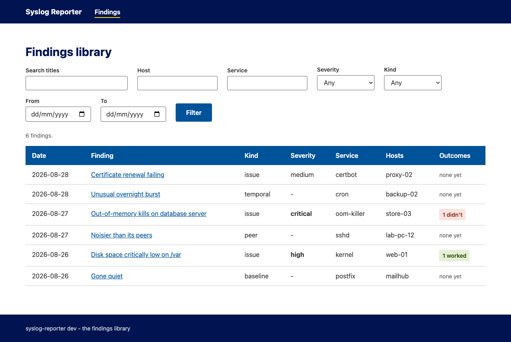
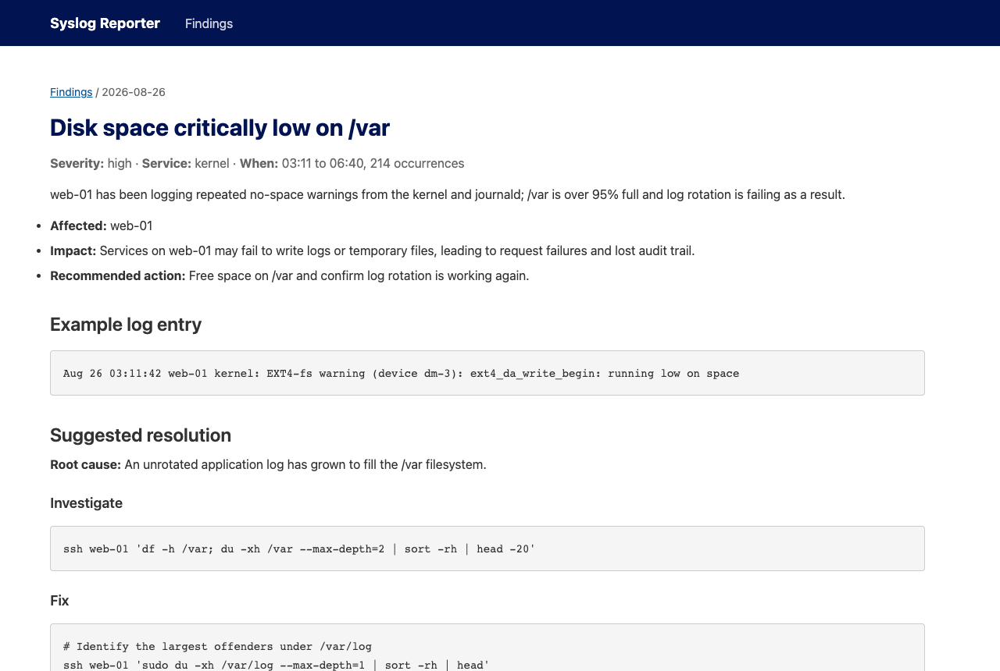

# syslog-reporter

Turns a noisy, org-wide syslog stream into a short, prioritised morning
email for sysadmins to look over.

Uses a bunch of 'background' noise filters to strip out the routine log
lines, then uses a LLM to explain what is left - and make concrete suggestions
for investigation and fixing them.

Also highlights things like boxes that suddenly become noisy, or conversely boxes
that go suspiciously quiet.

For a high-level tour of the process see
[HOW_IT_WORKS.md](HOW_IT_WORKS.md); for a deeper dive see
[TECHNICAL_OVERVIEW.md](TECHNICAL_OVERVIEW.md).

The binary also supports a historical library of findings and a web UI to browse them and mark them as good or bad solutions (to support later work on letting agents run 'known good' runbooks)



## What it does

- Filters a day of raw syslog text (or an ELK NDJSON dump) down to the
  lines that are unusual.
- Sends what is left to the LLM of your choice, which writes up genuine
  issues with severity, likely cause, and copy-pasteable investigate and
  fix commands. Any command that changes state is flagged
  `# CHANGES STATE:`.
- Compares every host and program against its fleet peers, its own recent
  history, and its own habits at that time of day, then has the LLM
  explain the strongest anomalies.
- Renders a short email digest plus a longer full report, and
  optionally sends them over as an email.
- Files every run's findings into a local SQLite library, browsable
  through a built-in web UI or from the terminal, with a
  worked / didn't-work vote on each finding so the team learns which
  suggested fixes actually fix things.

## Getting started

Grab a binary from the [releases page](https://github.com/ohnotnow/syslog-reporter-go/releases),
or build from source with Go:

```bash
git clone https://github.com/ohnotnow/syslog-reporter-go.git
cd syslog-reporter-go
go build -o syslog-reporter ./cmd/syslog-reporter
```

Configuration comes from environment variables, or a `.env` file next to
where you run it:

```bash
SYSLOG_DEFAULT_MODEL=openai/gpt-5.6-luna # litellm-style provider/model
OPENAI_API_KEY=sk-...                     # or ANTHROPIC_API_KEY for anthropic/ models
# for azure/ models on Azure OpenAI, set:
# SYSLOG_DEFAULT_MODEL=azure/your-deployment-name
# AZURE_OPENAI_ENDPOINT=https://your-resource.openai.azure.com/openai/v1/
# AZURE_OPENAI_API_KEY=...

# optional: literal strings to strip from anything sent to the LLM
# provider, e.g. your domain. Case-insensitive, replaced with [redacted].
# A courtesy for hiding estate identity - NOT PII/compliance redaction;
# if your logs need that, stick to --no-llm.
# SYSLOG_REDACT=example.ac.uk,10.20.
```

Then point it at a day of syslog:

```bash
# free run: filter + anomaly detection only, no LLM cost
./syslog-reporter /var/log/messages-20260827 --no-llm

# full run
./syslog-reporter /var/log/messages-20260827

# an ELK NDJSON dump works too, and .gz is handled
# (tools/elk_dump.py pulls a day of syslog from an ELK cluster into this format)
./syslog-reporter syslog-2026-08-27.ndjson.gz

# email the report: an HTML rendering of the digest for easy reading,
# with the digest and full report attached as markdown for copy/paste
# (or for handing straight to your own sysadmin agents)
./syslog-reporter syslog-2026-08-27.ndjson.gz --send-email --recipients team@example.ac.uk
```

The first week or two, run it daily (or backfill historical days with
`--no-llm --date YYYY-MM-DD`) so the SQLite history builds up. The noise
filter and the per-estate ignore lists are meant to be tuned to your
estate, and `--dump-filtered` shows exactly what they are letting
through. `./syslog-reporter --help` lists every flag;
[TECHNICAL_OVERVIEW.md](TECHNICAL_OVERVIEW.md) has the full flag and
environment-variable reference and the known-knowns suppression file.

## The findings library

Each batch run also records what it found (issues merged with their
suggested fixes, plus the explained anomalies) in the same SQLite file
as the history, so the morning report stops being throwaway. The
database uses SQLite's WAL mode, so a plain `cp` of a live file can
silently miss the most recent writes - back it up with
`sqlite3 syslog_aggregates.db ".backup backup.db"`, or copy it while
nothing is running. To browse the accumulated findings:

```bash
# a small web UI on http://127.0.0.1:7373
./syslog-reporter serve

# or straight from the terminal
./syslog-reporter findings list --host web-01 --severity high
./syslog-reporter findings show 42
./syslog-reporter findings feedback 42 worked --comment "cache cleared, sorted"
```

The web UI is the same single binary with no extra services: search and
filters over every past finding, and a worked / didn't-work vote (with
an optional note) on each one. By default it listens on localhost only
with no login; for a shared box there is a local-accounts mode
(`syslog-reporter user add`) and optional TLS. See
[HOW_IT_WORKS.md](HOW_IT_WORKS.md) for a tour with screenshots and
[TECHNICAL_OVERVIEW.md](TECHNICAL_OVERVIEW.md) for the full reference.

## The management report

Once a few weeks of history have accumulated, the same binary can render
a periodic summary for management: headline numbers,
a daily volume chart, issues by severity and the team's feedback votes,
as a self-contained HTML email.

```bash
# writes mgmt_report.html covering the last 30 days
./syslog-reporter mgmt-report

# a weekly flavour, emailed to the management list
SYSLOG_MGMT_RECIPIENTS=manager@example.ac.uk ./syslog-reporter mgmt-report --days 7 --send-email
```

## Example of an issue

```markdown
## 1. Sustained CPU overheating and saturation

**Severity:** critical · **Affected:** example-host

example-host repeatedly reaches near-total CPU utilization while package and core temperatures exceed thresholds and clock throttling occurs, indicating a persistent thermal and workload problem.

**Likely cause:** example-host has a persistent CPU workload combined with inadequate cooling or thermal/hypervisor contention, causing throttling and unsafe temperatures.

**Have a look:**

# Identify CPU consumers, temperatures, frequencies, throttling, and hardware errors on example-host
ssh example-host 'uptime; ps -eo pid,ppid,user,pcpu,pmem,etime,cmd --sort=-pcpu | head -30; vmstat 1 5; sensors 2>/dev/null; for f in /sys/class/thermal/thermal_zone*/temp; do echo "$f $(cat "$f")"; done; grep -iE "thermal|thrott|mce|hardware error" /var/log/messages /var/log/kern.log 2>/dev/null | tail -100'

**Try:**

# Check scheduled jobs and PCP alarm context
ssh example-host 'sudo systemctl list-timers --all; sudo crontab -l -u root; sudo journalctl -u pcp-pmie --since today --no-pager -n 100'
# Check CPU frequency, thermal zones, and virtualization metadata
ssh example-host 'lscpu; cpupower monitor 2>/dev/null | head -80; systemd-detect-virt; sudo ipmitool sdr elist 2>/dev/null | grep -Ei "temp|fan|power" || true'
# CHANGES STATE: Stop an identified runaway nonessential job before temperatures worsen
ssh example-host 'sudo systemctl stop <identified-runaway-unit>'
# CHANGES STATE: Move or disable the offending scheduled job after confirming ownership
ssh example-host 'sudo systemctl disable --now <identified-runaway-unit>'
# Recheck temperature and utilization after workload reduction
ssh example-host 'uptime; sensors 2>/dev/null; ps -eo pid,pcpu,pmem,cmd --sort=-pcpu | head -15'

_Note: Replace unit placeholders only after identifying the actual runaway unit; take example-host offline or power it down if temperatures remain beyond hardware limits._
```

The same write-ups land in the findings library, where each one can
later be marked as having fixed the problem or not:



## Contributing

Clone the repo, `go build`, `go test ./...`, and send a pull request.
Test fixtures use fictional hostnames only; please keep real estate
names out of code, tests and commits.

## Licence

Copyright (C) 2026 ohnotnow

This program is free software: you can redistribute it and/or modify it
under the terms of the GNU Affero General Public License as published by
the Free Software Foundation, either version 3 of the License, or (at your
option) any later version. See [LICENSE](LICENSE) for the full text.
